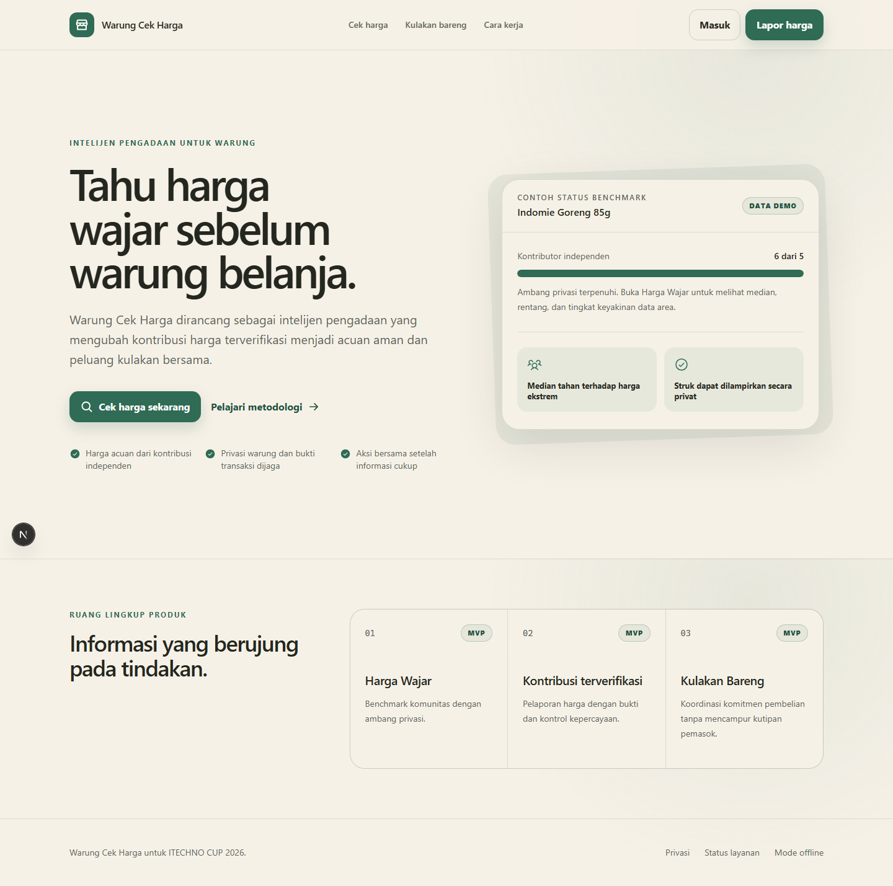
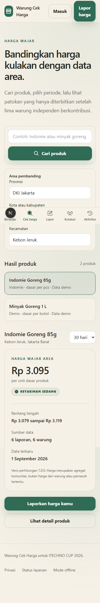
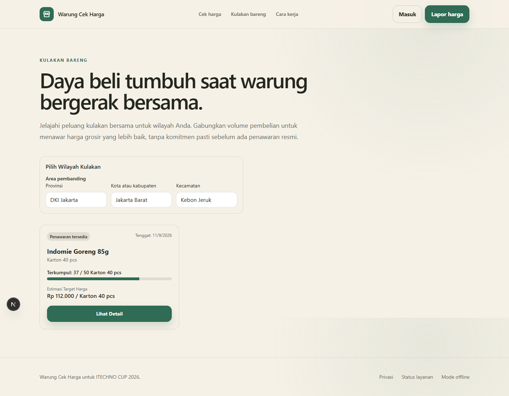

<div align="center">
  <h1>Warung Cek Harga</h1>
  <p>Intelijen pengadaan komunitas untuk warung Indonesia</p>
  <p>
    <a href="https://github.com/WarungTechnoCup/WarungMonorepo"></a>
    <a href="LICENSE"></a>
    
  </p>
  <p><strong>Submission for ITECHNO CUP 2026 - Web Development</strong></p>
  <p><strong>Tim: Garren Tanavaro</strong></p>
</div>

## Daftar Isi

- [Tim Pengembang](#tim-pengembang)
- [Tentang Proyek](#tentang-proyek)
- [Fitur Unggulan](#fitur-unggulan)
- [Demo dan Screenshot](#demo-dan-screenshot)
- [Teknologi](#teknologi)
- [Arsitektur Sistem](#arsitektur-sistem)
- [Instalasi dan Setup](#instalasi-dan-setup)
- [Penggunaan](#penggunaan)
- [Dokumentasi API](#dokumentasi-api)
- [Testing](#testing)
- [Lisensi](#lisensi)

## Tim Pengembang

| Nama            | Peran                                                                                                                              | GitHub                                              |
| --------------- | ---------------------------------------------------------------------------------------------------------------------------------- | --------------------------------------------------- |
| Anggota 1       | Contribute: autentikasi, pelaporan, dan kepercayaan                                                                                | Belum ditetapkan                                    |
| Anggota 2       | Act: Kulakan Bareng, integrasi, dan kesiapan demo                                                                                  | Belum ditetapkan                                    |
| Garren Tanavaro | Act: Membangun arsitektur Group Buying (Kulakan Bareng), dari skema database, API, hingga UI, serta menyiapkan integrasi data demo | [garrentanavaro](https://github.com/garrentanavaro) |

Pembagian kerja lengkap tersedia di [docs/team-workflow.md](docs/team-workflow.md).

## Tentang Proyek

### Latar Belakang

Warung dan pengecer mikro membutuhkan acuan harga kulakan yang mudah dipahami tanpa membuka identitas, alamat, atau bukti transaksi mereka. Perbedaan informasi harga membuat keputusan stok dan pembelian bersama lebih sulit dilakukan.

### Solusi

Warung Cek Harga adalah produk intelijen pengadaan komunitas. MVP menggabungkan Harga Wajar, kontribusi harga yang diverifikasi, dan Kulakan Bareng. Harga Wajar hanya ditampilkan setelah sedikitnya lima kontributor independen agar satu laporan tidak membentuk patokan publik. Produk ini mendukung SDG 8 sebagai fokus utama dan SDG 9 sebagai fokus pendukung.

MVP saat ini mencakup katalog, benchmark berambang privasi, autentikasi, normalisasi, kontribusi harga, unggah struk privat, aktivitas pengguna, serta daftar, detail, penawaran pemasok, dan komitmen Kulakan Bareng. Migrasi dan data demo telah diverifikasi pada project Supabase pengembangan. Lihat [docs/progress.md](docs/progress.md) untuk status terkini dan batas fitur preview.

### Tujuan

- Mengurangi kesenjangan informasi harga bagi pemilik warung.
- Memberikan acuan harga yang netral, berbasis kontribusi komunitas, dan menjaga privasi.
- Membantu pengguna beralih dari mengetahui harga ke tindakan pembelian bersama yang terukur.

## Fitur Unggulan

| Fitur                          | Tujuan                                                           | Status saat ini                                                  |
| ------------------------------ | ---------------------------------------------------------------- | ---------------------------------------------------------------- |
| Harga Wajar                    | Menampilkan benchmark harga setelah ambang kontributor terpenuhi | Diimplementasikan dengan data demo tersimpan                     |
| Kontribusi harga terverifikasi | Mengumpulkan laporan harga dengan perlindungan privasi           | Normalisasi, laporan, consent, aktivitas, dan struk privat aktif |
| Kulakan Bareng                 | Membantu pembelian bersama berdasarkan minat dan komitmen        | Daftar, detail, penawaran, dan komitmen diimplementasikan        |
| Warung Passport                | Pratinjau terbatas untuk data sensitif dan bukti kepercayaan     | Preview terbatas, bukan credit score atau keputusan pinjaman     |
| Batas akses aman               | Memisahkan route publik, terlindungi, dan admin                  | Diterapkan pada proxy, API, database, dan storage                |

Route admin, Passport, dan offline yang belum memiliki perilaku produk lengkap tetap ditandai sebagai scaffold agar tidak dianggap sebagai fitur produksi.

## Demo dan Screenshot

### Live Demo

Demo lokal siap dijalankan dengan langkah pada bagian instalasi. URL produksi harus ditambahkan di sini dan diuji pada browser bersih sebelum submission.

### Screenshot







### Video Demo

Belum tersedia. Video akan dibuat untuk presentasi final setelah alur Harga Wajar, kontribusi harga, dan Kulakan Bareng dapat didemonstrasikan.

## Teknologi

### Frontend

| Teknologi             | Fungsi                                      |
| --------------------- | ------------------------------------------- |
| Next.js 16 App Router | Kerangka aplikasi web dan route server      |
| React 19              | Komponen antarmuka                          |
| TypeScript            | Kontrak tipe dan keamanan saat pengembangan |
| Tailwind CSS 4        | Sistem gaya mobile-first                    |

### Backend dan Data

| Teknologi           | Fungsi                                              |
| ------------------- | --------------------------------------------------- |
| Node.js 24          | Runtime pengembangan dan produksi                   |
| Supabase PostgreSQL | Database aplikasi dan data demo terstruktur         |
| Supabase Auth       | Autentikasi email dan kata sandi                    |
| Supabase Storage    | Penyimpanan struk privat dengan kebijakan pemilik   |
| Drizzle ORM         | Definisi schema dan migrasi SQL yang dapat ditinjau |
| Zod                 | Validasi pada setiap batas write                    |

### DevOps dan Quality Gate

| Teknologi           | Fungsi                                               |
| ------------------- | ---------------------------------------------------- |
| pnpm 11             | Package manager dan lockfile reproducible            |
| Vitest              | Pengujian unit dan kontrak                           |
| Playwright          | Pengujian alur route pada desktop dan viewport 360px |
| ESLint dan Prettier | Konsistensi kode                                     |
| GitHub Actions      | Continuous integration untuk quality gate dan E2E    |
| Vercel              | Target deployment produksi                           |

### Alasan Pemilihan Teknologi

| Keputusan             | Alasan                                                                                |
| --------------------- | ------------------------------------------------------------------------------------- |
| Next.js App Router    | Mendukung route publik dan terlindungi dengan batas server yang jelas                 |
| Supabase dan Drizzle  | Menyediakan PostgreSQL, autentikasi, penyimpanan, dan migrasi yang dapat ditinjau tim |
| Tailwind CSS          | Memudahkan antarmuka konsisten dengan baseline mobile 360px                           |
| Vitest dan Playwright | Menguji logika serta pengalaman pengguna lintas viewport                              |

### Dependensi Utama

```json
{
  "next": "16.3.4",
  "react": "19.2.8",
  "@supabase/ssr": "^0.12.5",
  "drizzle-orm": "^0.44.5",
  "zod": "^4.1.11"
}
```

Versi lengkap tersedia di [package.json](package.json) dan dikunci dalam [pnpm-lock.yaml](pnpm-lock.yaml).

## Arsitektur Sistem

### Diagram Arsitektur

```text
Pengguna
  |
  v
Next.js App Router
  |-- Route publik dan API health
  |-- proxy.ts untuk refresh sesi dan batas route terlindungi
  |
  v
Adapter Supabase
  |-- Auth
  |-- PostgreSQL
  |-- Storage
  |
  v
Drizzle schema dan migrasi SQL
```

Project Supabase pengembangan, tabel domain, RLS, storage privat, migrasi, dan data demo telah diterapkan. Detail keputusan arsitektur tersedia di [docs/architecture.md](docs/architecture.md).

### Database Schema

Schema domain dan migrasi pertama mencakup warung, katalog, laporan harga, hasil normalisasi, benchmark, consent, metadata struk, dan audit. RLS aktif pada seluruh tabel domain, dan constraint database mencegah publikasi median di bawah lima warung independen. Detail tersedia di [docs/architecture.md](docs/architecture.md) dan [docs/privacy.md](docs/privacy.md).

### Struktur Folder

```text
src/
  app/              # Routes App Router dan API
  components/       # Komponen antarmuka bersama
  db/               # Entry point Drizzle
  lib/              # Env, Supabase, dan utilitas bersama
  test/             # Helper pengujian
  types/            # Tipe API bersama
tests/e2e/          # Pengujian Playwright desktop dan mobile
docs/               # Dokumen kompetisi, arsitektur, dan workflow tim
docs/decisions/     # Architecture Decision Records
docs/source/        # Salinan spesifikasi Markdown
drizzle/            # Direktori migrasi SQL
scripts/            # Script pengembangan
.github/            # Konfigurasi CI
```

## Instalasi dan Setup

### Prerequisites

- Node.js 24
- pnpm 11
- Git

### Clone Repository

```bash
git clone https://github.com/WarungTechnoCup/WarungMonorepo.git
cd WarungMonorepo
```

### Install Dependencies

```bash
pnpm install --frozen-lockfile
```

### Environment Configuration

```bash
cp .env.example .env.local
```

Isi `.env.local` sesuai kebutuhan lingkungan. Jangan pernah memasukkan nilai rahasia ke Git.

| Variabel                               | Kegunaan                                        |
| -------------------------------------- | ----------------------------------------------- |
| `NEXT_PUBLIC_APP_URL`                  | URL aplikasi                                    |
| `NEXT_PUBLIC_SUPABASE_URL`             | URL project Supabase                            |
| `NEXT_PUBLIC_SUPABASE_PUBLISHABLE_KEY` | Publishable key Supabase untuk browser          |
| `DATABASE_URL`                         | Connection string transaction pooler PostgreSQL |
| `SUPABASE_STORAGE_BUCKET`              | Nama bucket struk privat, default `receipts`    |
| `SUPABASE_SERVICE_ROLE_KEY`            | Khusus script pembuatan akun demo, server only  |
| `DEMO_MODE`                            | Penanda mode demo                               |
| `E2E_DEMO_EMAIL`                       | Email akun demo lokal dan E2E                   |
| `E2E_DEMO_PASSWORD`                    | Kata sandi akun demo lokal dan E2E              |

Konfigurasi Supabase diperlukan untuk data live dan route terlindungi. Tanpa konfigurasi, build tetap berhasil dan route terlindungi gagal secara aman dengan pesan yang dapat ditindaklanjuti.

### Database Setup

```bash
pnpm db:generate
pnpm db:migrate
pnpm db:seed
pnpm db:create-demo-user
```

Perintah database memuat `.env.local`, menjalankan migrasi, dan menyiapkan data sintetis Harga Wajar serta Kulakan Bareng. Pembuatan akun demo memerlukan service-role key dan kredensial demo privat. Jalankan hanya pada project Supabase pengembangan yang telah ditinjau.

### Run Locally

```bash
pnpm dev
```

Buka [http://localhost:3000](http://localhost:3000). Untuk build produksi, gunakan `pnpm build` lalu `pnpm start`.

## Penggunaan

### Pengguna Umum

Route publik Harga Wajar:

- `/`
- `/cek-harga`
- `/produk/[slug]`
- `/kulakan-bareng`
- `/kulakan-bareng/[id]`
- `/cara-kerja`
- `/privasi`
- `/masuk`

`/cek-harga` dan `/produk/[slug]` membaca katalog serta benchmark dari API dan database. Route Kulakan Bareng menampilkan peluang aktif, progres komitmen, estimasi target, dan penawaran pemasok yang dipisahkan dari benchmark komunitas.

### Pengguna Terautentikasi

Route berikut memiliki batas akses fail-closed dan perilaku Harga Wajar:

- `/lapor-harga`
- `/lapor-harga/sukses`
- `/aktivitas`
- `/passport`

### Admin

`/admin` disediakan sebagai route shell. Otorisasi admin dan operasi admin belum diimplementasikan.

## Dokumentasi API

Endpoint yang tersedia meliputi health, katalog, benchmark, pratinjau normalisasi, pengiriman laporan idempotent, aktivitas pemilik, peluang Kulakan Bareng, detail peluang, dan komitmen terautentikasi.

```bash
curl http://localhost:3000/api/health
```

Contoh respons lokal tanpa konfigurasi layanan:

```json
{
  "data": {
    "status": "ok",
    "version": "0.1.0",
    "services": {
      "database": false,
      "supabase": false,
      "storage": false
    }
  }
}
```

Kontrak API menggunakan `ApiSuccess<T>` untuk respons sukses dan `ApiFailure` untuk respons gagal. Benchmark `insufficient` tidak membawa statistik harga, sedangkan benchmark `available` hanya membawa agregat yang diizinkan.

## Testing

```bash
pnpm test
pnpm test:coverage
pnpm test:e2e
pnpm check
```

`pnpm check` menjalankan Prettier, ESLint, TypeScript, Vitest, dan production build. Playwright memeriksa route publik, batas autentikasi, Harga Wajar, dan Kulakan Bareng pada viewport desktop dan mobile 360px.

## Lisensi

Proyek ini dilisensikan di bawah [MIT License](LICENSE).

## Dokumentasi Lanjutan

- [AGENTS.md](AGENTS.md): aturan kontribusi untuk coding agent dan engineering handbook ringkas.
- [CONTRIBUTING.md](CONTRIBUTING.md): alur clone sampai pull request untuk kontributor manusia.
- [docs/competition-requirements.md](docs/competition-requirements.md): tracker persyaratan submission dan penilaian ITECHNO CUP 2026.
- [docs/architecture.md](docs/architecture.md): batas arsitektur, akses, dan data.
- [docs/methodology.md](docs/methodology.md): metodologi Harga Wajar yang direncanakan.
- [docs/privacy.md](docs/privacy.md): aturan privasi dan data sensitif.
- [docs/ai-usage.md](docs/ai-usage.md): catatan penggunaan AI dan review manusia.
- [docs/demo-script.md](docs/demo-script.md): kerangka demonstrasi dan presentasi.
- [docs/progress.md](docs/progress.md): status implementasi dan pekerjaan berikutnya.
